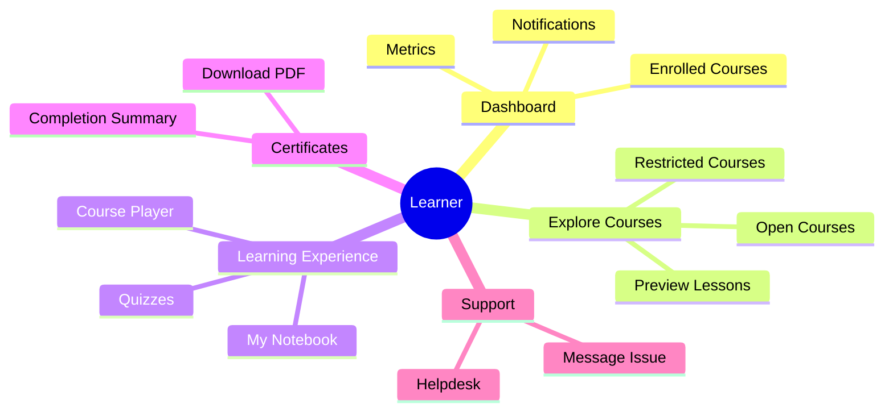
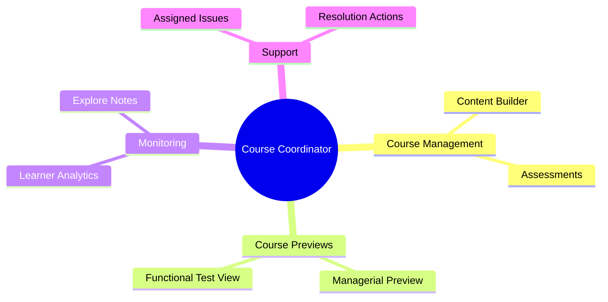
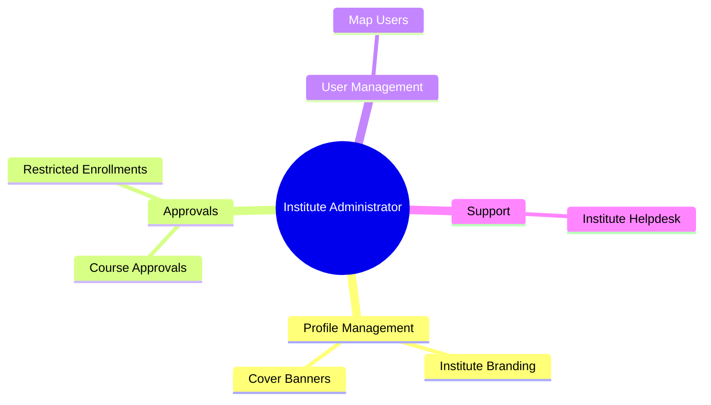
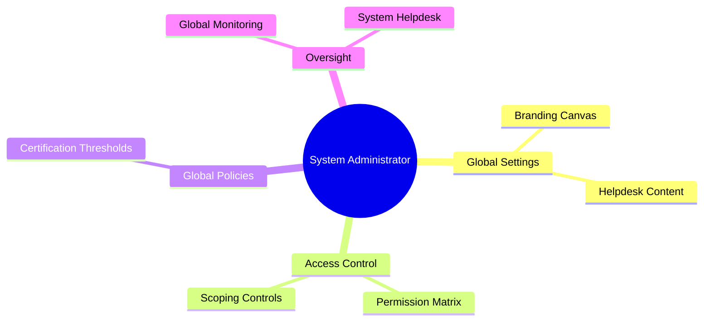

# DIYA LMS User Manual

Welcome to the DIYA Learning Management System (LMS). This guide provides role-specific instructions to help you navigate and utilize the platform effectively. Please refer to the section that corresponds to your assigned role.

---

## 1. Learner Guide

As a Learner, the DIYA LMS provides you with a comprehensive dashboard to track your progress, explore new learning opportunities, and manage your certifications.

### Dashboard & Navigation
- **My Dashboard**: View a horizontal list of your enrolled courses. Summary tiles and engagement charts track your learning minutes, average progress, and completed modules/lessons.
- **Notifications**: Check the **Bell Icon** at the top right for new alerts regarding your enrollment requests and helpdesk tickets. You can mark notifications as read individually or clear them all at once.

### Exploring and Enrolling in Courses
- **Course Explorer**: Browse the catalog of available, published courses.
- **Pre-enrollment Preview**: Click on a course to view introductory lessons and the syllabus before enrolling.
- **Open Courses**: Click **Enroll Now** to instantly access the course materials.
- **Restricted Courses**: Click **Enroll Now** to submit an enrollment request. You can provide a justification message and attach an optional supporting PDF document (up to 1MB).
  - Track your request status in the **Restricted Course Enrollment Approval** tab.
  - If a request is rejected, you can view the reviewer's comments and resubmit (up to 5 attempts allowed per course).

### Learning Experience
- **Course Player**: Access videos, PDFs, and rich-text lesson materials. The player will save your progress automatically.
- **Quizzes**: Complete quizzes at the end of modules. Your quiz scores are recorded and evaluated against the course completion policy.
- **My Notebook**: Take inline class notes during lessons. You can view, manage, and delete your notes under the **My Notebook** tab on your dashboard.

### Certificates
- **Completion Summary**: Once you reach 100% course progress and pass the required evaluations, navigate to the Completion Summary page.
- **Download Certificate**: If you meet the eligibility criteria, you can instantly generate and download your verified Digital Certificate (`DIYA-LMS-...`).

### Support & Helpdesk
- **Helpdesk Tab**: Access user guides, contact information, and the "Reach Us" details.
- **Message Issue**: Submit a ticket for any technical or course-related issues.
- **Issue Resolution Status**: Track the progress of your submitted issues and view replies from administrators or coordinators.

---

## 2. Course Coordinator Guide

As a Course Coordinator, your primary role is to build, manage, and monitor the courses within your domain.

### Course Creation & Management
- **Content Builder**: Create modules, upload video lectures, attach PDF documents, and format rich-text lessons.
- **Assessments**: Build quizzes and define evaluation outcomes to test learner comprehension.
- **Course Previewing**: 
  - **Managerial Preview**: Experience the course exactly as a learner would, complete with lock constraints and previews.
  - **Functional Test View**: Use this mode to verify tracking metrics, HUD counts, and system behavior without impacting live learner data.

### Learner Engagement
- **Analytics**: Monitor learner progress, quiz scores, and engagement within your assigned courses.
- **Explore Notes**: If permitted by your institute's RBAC policies, you can explore the public notes taken by learners in your courses to gauge comprehension.

### Helpdesk & Issue Resolution
- **Assigned Issues**: When a learner submits a ticket related to your course, you will receive a notification.
- **Resolution**: Access the Helpdesk to communicate with the learner, provide support, and mark the issue as resolved.

---

## 3. Institute Administrator Guide

Institute Administrators oversee the operations, courses, and users within a specific institute.

### Institute Profile Management
- **Branding**: Update your institute's landing page. You can upload and adjust a full-fit cover banner (1600x600) and update the institute's logo and description to maintain brand identity.

### Course & Enrollment Approvals
- **Course Approval Tab**: Review courses drafted by Course Coordinators. Ensure content quality before moving courses from `Draft` or `Pending Approval` to `Published` status.
- **Restricted Enrollments**: Review enrollment requests for restricted courses under your institute.
  - View learner justifications and attached PDF proofs.
  - Provide a decision comment when approving or rejecting a request.

### User & Support Management
- **Map Users**: Assign learners and Course Coordinators to your institute.
- **Institute Helpdesk**: Monitor escalated Helpdesk issues within your institute. Respond to tickets and ensure timely resolutions.

---

## 4. System Administrator Guide

System Administrators have overarching control of the DIYA LMS platform, including global settings, security, and broad oversight.

### Global Settings & Branding
- **Branding Edit Canvas**: Modify global system branding, including sidebar logos and color gradients. The editor supports independent horizontal and vertical image resizing.
- **Helpdesk Content Management**: Use the built-in rich-text editor to update the platform-wide **Contact**, **About Us**, and **Reach Us** tiles on the Helpdesk page.

### Role-Based Access Control (RBAC)
- **Permission Matrix**: Manage granular access rights across the platform. Define which roles can view specific menus, tabs, or perform actions (e.g., `courses.approval`, `help.issue.resolve`).
- **Scoping Controls**: Define the data visibility breadth for different roles (e.g., whether a user can see data across all institutes or only their assigned institute).

### Certification & Global Policies
- **Certification Policies**: Configure global Course Completion Policies, defining the thresholds required for progress, quiz scores, and automated certificate issuance.

### Platform Oversight
- **Global Monitoring**: Oversee all institutes, course approvals, and system-wide learner engagement metrics.
- **System Helpdesk**: Act as the final escalation point for Helpdesk issues that cannot be resolved at the Course Coordinator or Institute Admin levels.
